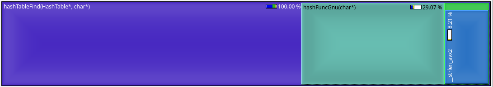
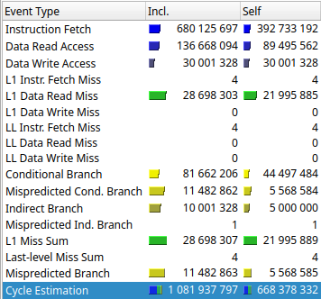

The goal of this work is to implement a hash table, compare efficency of different hash functions, then optimise this code using assembler optimization

Hash table is a method of implementing [associative array][wiki_map] by splitting elements into several so-called buckets using a hash function, so an index of bucket for a specific element is equal to hash function value for it (mod count of buckets). This allows to use quite small (1-2 elements) buckets, so the lookup time is low (search is only needed in 1 bucket). Due to the low typical size of a bucket, it is not effective to use any complex data structure for it. Arrays or lists will do the task just fine. It is important to choose good hash function, which gives even distribution of elements between buckets. Otherwise, there will be more elements in specific buckets, which causes search in these buckets to be wery slow. These buckets will be the most frequently searched (if requests have distribution similar to the one of hashtable data), so the average search time will be high.

In this task, we make a hash table for storing words of text. For simplicity, hash table is a simple set, which returns "found" or "not found". "The tradegy of Hamlet" was used as the test data. Duplicates are not put into hash table. Search is tested on randomly chosen words of the same text. Actually, the problem of algorithm used to split words is that it produces a high ammount of empty strings (between two space-like characters) These strings were put into hash table (first of them, others are excluded as duplicates), but do not search for them while testing performance, as it highly affects the results.

## Hash function comparison
The following hash functions were compared:
1. 1; Just one.
2. first character (ASCII code)
3. length
4. Sum of ASCII codes
5. Start at 0. each step, rotate value left, then XOR it with next char. Return last value.
6. Same as 5, but rotate right instead of left
7. GNU hash (start at 5381, each step *33 and add next char)

Hash table is better with more even distribution of words between buckets. Let's analyze how this distribution affects performance. We expect that distribution of values we search for matches distribution of values in table. Actually it is not always the case, but it is too difficult to account for that. So, if we choose a random value, probability that it will fall into certain bucket is **(bucket size / total size)**. After the bucket was chosen, the weight of search in that bucket is also proportional to its size. So each bucket impacts performance as square of its size / total size.

This allows us to define a value, which can be used to compare hash functions:  
***badness*** = (sum of squared bucket sizes) / (total size)

1) is just nothing. Worst perfrmance, everything in 1 bucket.  
Badness: **8316** (equal to full size of table)

2) First char. Does help a bit, but is capped at 128 and ,because of difference in frequencies it causes strings to accumulate in specific buckets  
Badness: **~325**

3) Length. Even worse, because there are just several typical lengths  
Badness: **~1091**

4) Sum. This gets a lot better. Howewer, it is not ideal: character codes used in text are distributed unevenly, so words tend to accumulate in groups with similar sums
Badness: **~15.4**

5) Rol+xor Good hash. Words are distributed quite evenly between buckets  
Badness: **~14.8**

6) Ror+xor Does not work well. The way lesser bits get shifted into higher ones caused some big periodic structures to appear.
(notice the scale)  
Badness: **~21.4**

7) GNU hash. Pretty good. Slightly better than rol+xor.  
Badness: **~14.6**

So, after examining different hash functions, GNU hash was chosen as the best candidate.

## Optimisations

I used callgrind profiler to measure the relative performance. Compared to just measuring the execution time, it gives a lot more info, helping to narrow down the problem. Also, it is not random as opposed to time measurements. Execution time can fluctuate more than 10% under the same conditions due to OS interrupting process at random times. If conditions (like ambient temperature, and, as a result CPU temperature) changes, than it can change even more. Howewer, callgrind/cachegrind use just some models approximating real CPU performance, which may be a bit different. So, Callgrind is used in optimisation, actual timings (measured using rdtsc instruction) are given for first and last variant for comparison.

Hash table was optimised for distribution of words in this text (mostly typical lenghts and frequencies) As I think, it is close to typical values for english texts.

First, we determine the main bottleneck by profiling code using callgrind. Kcachegrind was used to display the results. We optimise function "hashTableFind", so ignore everything outside. HTBucketFind is already inline, so it is displayed as part of hashTableFind. We see the following distribution of performance: 

We can see that strcmp function has the highest perfomance impact. So it is the first optimisation point.
Good solution is to use avx instructions to compare strings instead of strcmp. This allows us to store test string (up to 32 chars) directly in avx register, and compare everythin with it with just a few instructions. Howewer, this does not work with strings longer then 31 characters, so set a fallback strcmp for that. It will not be used frequently because words we compare rarely exceed 31 chars. With this optimisations, we increase performance, but loose hardware compatibility. Also, code is linked to specific stored data type. Other problem is requirement to read first 32 bytes from every input string (even past the end).

Profiling_results:

We see that it did help a bit. But things can be optimised even further. First, unaligned instructions were used to load each bucket value from memory. Second, D1 cache miss rate is quite high due to the lack of spatial locality (all strings are in random places of memory) Both these issues can be addressed by storing strings as si256 directly in data area of a bucket. The problem may arise that longer strings do not fit there, but it is easily solved using the last '\0' bytes of string as indicator that it is longer than normal and just store pointer in this case. Such pointer will never be equal to any normal string, and when comparing strings 'the old way' we check that byte to determine if it is pointer or not. Howewer, instead of comparing just first bytes, we need to set all past-the-end bytes to 0. It appears to take more performance (instruction fetch)

Zeroing past-the-end bytes of string can be done more effectively. First, we use comparison to fill a mask regiter with 00 and FF bytes, (where nonzero and '\0' was respectively) and then use bit shift + bitwise OR to expand 0xFF bytes all over to the left. Then, because bit shift only works within 128bit lanes, instead of last shift+or we need to explictly check if there is something in right half and if so, fill left.  
Results:

We see that L1 cache misses went 30% down, (reading string from the bucket for comparison misses ~50% times, which is good, considering that cache line size is 512 bytes, or two si256`s) Memory reads and instruction count went down also, because strlen got optimized out and 1 pointer dereference when we requested a new string from bucket is not needed. Now hash function becomes a major bottleneck, as it takes almost 35% of instructions and branches, 30% of data reads and L1 misses. So it is a new optimisation point.

It is hard to do anything with GNUhash due to the nature of operations this function performs: it operates not with multiple values at once, but with one value again and again. Maybe something can be done to group together these operations, but it is hard. The solution is to replace hash function with the one implemented as instuction of CPU we use. I use crc32 (implemented as part of SSE4.2). 

The first obvious step is to use 8-bit crc32 for charecters of string directly.  
Results:  

It causes significant performance increase. Still, it does not solve the problem with data reads and branches.

This can be optimized further. Using 16-bit crc32 on strings is easy to implement as we already have 1 byte ('\0') we can use as padding.  
Results:  

As we see, it is a questionable optimization: 1% more instructions, 9% less data reads, fraction of percent less branches and cache misses. Cycle estimation even went up. So reject this optimisation.

Still, I couldn`t find any way of optimising the search even further, but, looking at compiler asm output for hash function I thought that it can be optimised a bit.

I wrote my own variant in assembly:

    hashFuncCrc:
        mov rsi, rdi
        mov rdi, 5381
        xor rax, rax
        .crc_loop_start:
            lodsb
            crc32 rdi, rax
            test rax, rax
            jnz .crc_loop_start
        mov rax, rdi
        ret
Results:

Actually that did decrease cycle estimation by less than 1%. Optimisation was totally not worth it. Last two optimisations were totally ineffective. So it's time to stop.

There is still one thing left to do: remove a reference to hash function by pointer and inline it into hash table. This will remove the ability to change hash function, but also will remove the cost of calling that function. This is a final optimisation. 
Results:

[wiki_map]: https://en.wikipedia.org/wiki/Associative_array]
